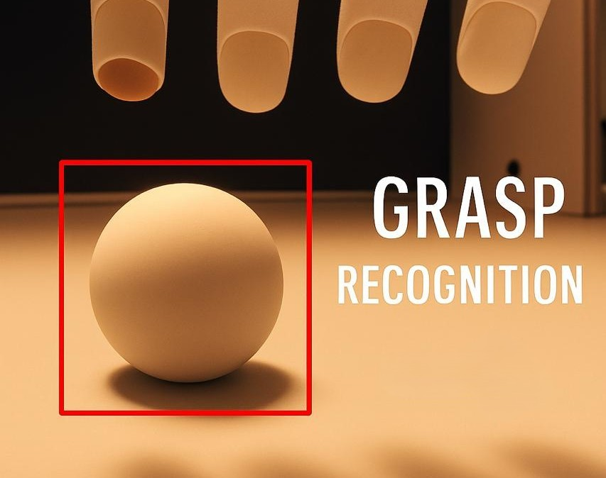
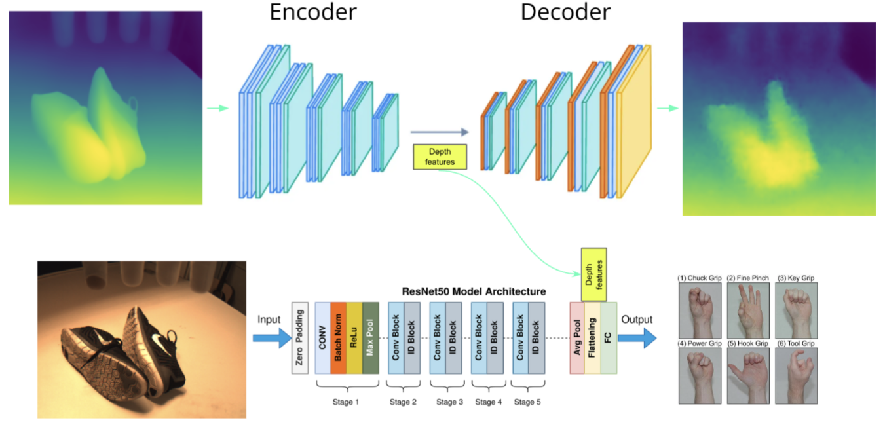
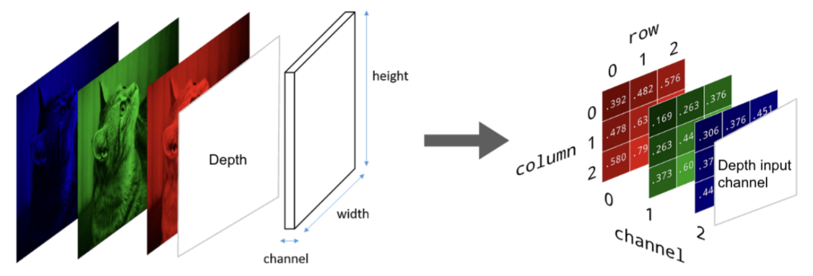
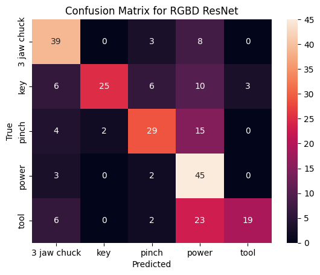
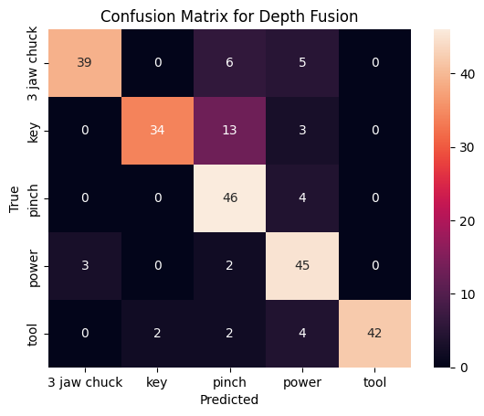
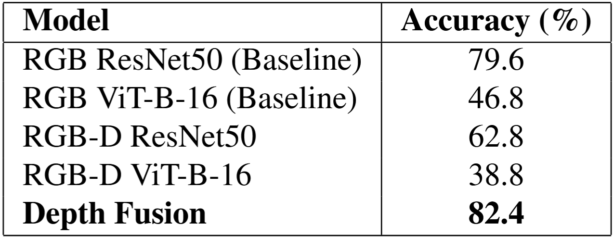

# Deep Learning for Computer Vision

> **TL;DR:** Late fusion of RGB features with a pretrained depth autoencoder latent (512-d) achieves **82.4%** grasp classification accuracy across 5 grasp types, outperforming the RGB-only ResNet50 baseline (79.6%) and early RGBD concatenation (62.8%).

<p align="center"><strong>Depth-aware multimodal grasp classification via RGB-D feature fusion and learned depth priors.</strong></p>

---

## Table of Contents
1. [Problem & Approach](#problem--approach)
2. [Dataset & Grasp Taxonomy](#dataset--grasp-taxonomy)
3. [Model Variants](#model-variants)
4. [Methodology](#methodology)
5. [Results & Analysis](#results--analysis)
6. [Research Paper](#research-paper)
7. [Repository Structure](#repository-structure)
8. [Reproducibility](#reproducibility)
9. [Future Work](#future-work)

---

## Problem & Approach
Accurately inferring the correct human grasp for a given object is critical in assistive and prosthetic manipulation. Pure RGB features can be ambiguous when objects share texture or color but differ in geometry (e.g., flat key vs cylindrical tool). Monocularly inferred depth offers geometric priors without requiring dedicated depth hardware. We compare three paradigms:

1. **RGB (ResNet50 baseline):** Appearance-only.
2. **RGBD (early concat):** Direct 4-channel input; depth treated uniformly with RGB at conv1.
3. **Depth Fusion (late concat):** Separate depth encoding (autoencoder) → 512-d latent fused with RGB features before classification.

**Why fusion wins:** Depth semantics learned in its own representation space are more complementary than early raw concatenation, improving separability among similar-looking grasp categories (Key vs Pinch) and reducing Power grasp overprediction.

---

## Dataset & Grasp Taxonomy
| Source | Images | Objects / Categories | Notes |
|--------|--------|----------------------|-------|
| DeepGrasping | 1,035 | 280 objects | 640×480 resolution; monocular depth estimated |
| ImageNet-derived | 5,180 | 25 grouped categories | Grouping applied; exact class list not in paper |
| HandCam (Test) | 250 | 50 objects | Prosthetic-mounted camera captures |

**Grasp Classes (5):** Key, Pinch, Power, Three Jaw Chuck, Tool.

**Depth Modality:** Monocular depth maps generated using “Depth Anything” (CVPR 2024). Depth available for all RGB frames; precise paired RGB-D total not explicitly enumerated beyond per-dataset counts.

**Capture Details:** HandCam device (model unspecified), standard indoor conditions; augmentation applied (paper references but does not enumerate transforms). Lighting/FPS specifics not provided.

---

## Model Variants
| Variant | Input Channels | Depth Usage Strategy | Fusion Stage | Initialization Notes | Expected Strengths | Trade-offs |
|---------|----------------|----------------------|--------------|----------------------|--------------------|------------|
| RGB ResNet50 | 3 (RGB) | None | N/A | ImageNet pretrained | Strong baseline, stable features | Misses geometry cues |
| RGBD ResNet50 | 4 (RGB+Depth) | Early concatenation | Input layer (conv1) | 3 RGB channels frozen; depth channel random init | Simple integration of depth | Shallow assimilation; depth semantics underutilized |
| Depth Fusion | 3 (RGB) + latent depth (512) | Parallel encoding then concat | Post-backbone (flattened features) | ResNet50 pretrained + pretrained depth AE encoder | Rich complementary modality fusion | Added complexity; two-stage training |

**Depth Autoencoder Encoder Output:** 512-d latent vector concatenated with flattened RGB backbone features prior to classification head.

---

## Methodology
1. Monocular depth estimation applied to all RGB frames (Depth Anything).
2. Depth autoencoder trained with MSE reconstruction; encoder frozen for feature extraction.
3. RGB ResNet50 features extracted (pretrained ImageNet weights).
4. Three pathways compared:
   - Baseline: Direct classification on RGB features.
   - RGBD: Modified first convolution to accept 4 channels; depth filters learned while RGB filters frozen initially.
   - Fusion: Concatenate depth encoder latent (512) with RGB feature vector → fully connected classifier.
5. Training (CNNs): 100 epochs, batch size 64, Adam (lr=1e-3, β1=0.9, β2=0.999), cross-entropy.
6. Training (ViT baselines): 10 epochs, batch size 32, Adam (lr=1e-3, weight decay 0.05).

### System Illustration
<div align="center">
  
  <p><em>Object visual and inferred depth → feature extraction → (optional) depth encoding → fusion → grasp classification.</em></p>
</div>

---

## Results & Analysis

### Reported Accuracy (Paper Table 2)
| Model | Modality Strategy | Accuracy (%) |
|-------|-------------------|--------------|
| RGB ResNet50 | Appearance only | 79.6 |
| RGB ViT-B-16 | Appearance only | 46.8 |
| RGBD ResNet50 | Early depth concat | 62.8 |
| RGBD ViT-B-16 | Early depth concat | 38.8 |
| Depth Fusion (ResNet50 + AE) | Late feature fusion | 82.4 |

*Macro F1, per-class F1, inference time, and parameter counts were not reported; placeholders may be added if later computed.*

### Qualitative Depth Fusion Diagram

<em>Depth autoencoder reconstructs depth maps; encoder latent (512) augments RGB features.</em>

### Comparative Architecture Visualization
<div align="center">
  
</div>
<em>Modified first conv layer for early depth concatenation (RGBD model).</em>

### Confusion Matrices (RGB / RGBD / Depth Fusion)

| RGB | RGBD | Depth Fusion |
|-----|------|--------------|
|  |  |  |

**Observations:**
- Key vs Pinch overlap decreases when incorporating depth semantics.
- Early concatenation underutilizes depth, leading to weaker diagonal integrity.
- Late fusion leverages a structured latent (512-d) ⇒ improved per-class separation and reduced systematic Power overprediction.

### Aggregate Performance Visualization
<div align="center">
  
</div>

---

## Research Paper
**Title:** Achieving Dexterous Manipulation via Vision for Stroke Patients  
**Authors:** Vishesh P Arora, Rosh Ho  
**Depth Generation:** Monocular model “Depth Anything” (CVPR 2024)  
**PDF:** See `final_project/Exoglove-grasp-capturing-ML.pdf`

### Paper Preview (First Pages)
<em>(Add preview images here if desired.)</em>

---

## Repository Structure
```
final_project/
  images/                # Figures and confusion matrices
  working/               # C++ capture / point cloud (RealSense prototype)
hw1–hw4/                 # Coursework progression
README.md                # Current documentation
```

---

## Reproducibility
| Component | Status | Notes |
|-----------|--------|-------|
| RGB baseline | Reproducible | Standard ResNet50 fine-tune |
| RGBD model | Reproducible | Requires conv1 weight reshape & depth channel init |
| Depth AE | Partially | Architecture described; latent=512, MSE loss |
| Fusion classifier | Reproducible | Concatenate latent + RGB features |
| ViT baselines | Reproducible | Short training schedule (10 epochs) |

**Training Core Settings:** Epochs=100 (CNN), batch=64, lr=1e-3, Adam.  
**Missing:** Exact resize strategy, normalization statistics, raw confusion counts.

---

## Future Work
- Joint end-to-end training of fusion (unfreeze depth encoder).
- Incorporate temporal sequences for dynamic grasp transitions.
- Integrate explicit hand pose estimation for multi-modal fusion.
- Explore attention-based cross-modal alignment instead of concatenation.
